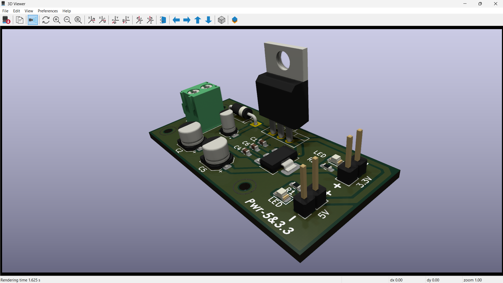

# ⚡ DualRail-PSU-PCB

> A compact dual-output regulated power supply PCB delivering **5V @ 1A** and **3.3V @ 1A** from a wide input range of **7V to 40V DC**.



---

## 📌 Overview

DualRail-PSU-PCB is a beginner-to-intermediate level PCB design project built using **KiCad 9.0**. It takes an unregulated DC input and provides two clean, stable regulated outputs — perfect for powering microcontrollers, sensors, and embedded systems like Arduino, ESP32, and STM32.

This is a **portfolio/learning project** designed to demonstrate PCB design skills including schematic capture, component selection, layout, and design rule checking.

---

## ✨ Features

- 🔌 Wide input range: **7V to 40V DC**
- ⚡ Dual regulated outputs: **5V @ 1A** and **3.3V @ 1A**
- 🛡️ Reverse polarity protection via **1N5819 Schottky diode**
- 💡 Input power indicator LED
- 💡 Output indicator LEDs for both 5V and 3.3V rails
- 🔩 Screw terminal connectors for easy wiring
- 🧲 Compact PCB form factor
- ✅ Designed and verified in KiCad 9.0

---

## 🔧 Specifications

| Parameter | Value |
|---|---|
| Input Voltage | 7V – 40V DC |
| Output 1 | 5V @ 1A |
| Output 2 | 3.3V @ 1A |
| Regulator 1 | LM7805 (TO-220) |
| Regulator 2 | AMS1117-3.3 (SOT-223) |
| Protection | Reverse polarity (1N5819) |
| PCB Layers | 2 (F.Cu + B.Cu) |
| PCB Size | ~90mm x 50mm |
| Designed With | KiCad 9.0 |

---

## 🗂️ Schematic Explanation

### 1. Input Stage
- **J1** — 2-pin screw terminal accepts 7V–40V DC input
- **D1 (1N5819)** — Schottky diode provides reverse polarity protection with minimal voltage drop
- **C3 (0.33µF)** and **C1 (0.1µF)** — Input filter capacitors to clean incoming supply noise
- **PWR_FLAG** — Tells KiCad ERC that this net is externally driven

### 2. Input Indicator LED
- Zener clamp circuit with resistor + LED indicates input power presence
- Works across full 7V–40V range without burning the LED

### 3. 5V Regulation Stage
- **U1 (LM7805 TO-220)** — Linear voltage regulator, outputs fixed 5V
- **C2 (10µF)** — Bulk output capacitor for load transient response
- **C4 (0.1µF)** — High frequency bypass capacitor
- **R1 (330Ω) + D2 (LED)** — 5V output indicator

### 4. 3.3V Regulation Stage
- **U2 (AMS1117-3.3 SOT-223)** — LDO regulator powered from 5V rail
- Input taken from 5V output — minimizes heat dissipation across U2
- **C5 (10µF)** — Mandatory output stability capacitor (required by AMS1117)
- **C6 (0.1µF)** — High frequency bypass capacitor
- **R2 (100Ω) + D3 (LED)** — 3.3V output indicator

### 5. Output Connectors
- **J2** — 2-pin screw terminal for 5V output
- **J3** — 2-pin screw terminal for 3.3V output

---

## 🔌 How to Use / Connect

### Step 1: Connect Input Power
```
J1 Pin 1 → Positive (+) of your DC supply (7V to 40V)
J1 Pin 2 → Negative (−) / Ground
```

### Step 2: Connect Your Load
```
5V Output:
  J2 Pin 1 → 5V positive to your device VCC
  J2 Pin 2 → GND

3.3V Output:
  J3 Pin 1 → 3.3V positive to your device VCC
  J3 Pin 2 → GND
```

### Step 3: Power On
```
✅ 5V LED lights up     → 5V rail is active
✅ 3.3V LED lights up   → 3.3V rail is active
```

### ⚠️ Warnings
- Never exceed **40V** input
- Always use a suitable **Heatsink** for optimal performance
- Never draw more than **1A** from either output simultaneously without heatsink on U1
- Always verify polarity before connecting — reverse polarity diode protects but it's good practice

---

## 🚀 Future Improvements

- [ ] Add **adjustable output voltage** using LM317 instead of fixed LM7805
- [ ] Switch to **switching regulator (LM2596)** for better efficiency at high input voltages
- [ ] Add **USB Type-C output** (5V/3A) for modern devices
- [ ] Add **short circuit protection** with fuse or current limiting
- [ ] Add **voltage display** using 7-segment or OLED
- [ ] Design **SMD version** for compact form factor
- [ ] Add **overcurrent indicator LED**
- [ ] Design enclosure/case for the board

---

## 🛠️ Tools Used

| Tool | Purpose |
|---|---|
| KiCad 9.0 | Schematic + PCB design |
| ngspice (KiCad built-in) | SPICE simulation |
| KiCad 3D Viewer | PCB visualization |

---

## 📚 References

- [LM7805 Datasheet — Texas Instruments](https://www.ti.com/lit/ds/symlink/lm7805.pdf)
- [AMS1117 Datasheet — Advanced Monolithic Systems](http://www.advanced-monolithic.com/pdf/ds1117.pdf)
- [1N5819 Datasheet — Vishay](http://www.vishay.com/docs/88525/1n5817.pdf)
- [KiCad Documentation](https://docs.kicad.org)

---

## 👤 Author

**Gowsh**
- GitHub: [@Gowshik-21](https://github.com/Gowshik-2I)
- LinkedIn: [Gowshik Babu D](https://www.linkedin.com/in/gowshik-babu-d-154b30313)

---

## 📄 License

This project is open source under the [MIT License](LICENSE).

Feel free to use, modify, and distribute for personal or commercial projects.

---

*Designed with ❤️ using KiCad 9.0*
